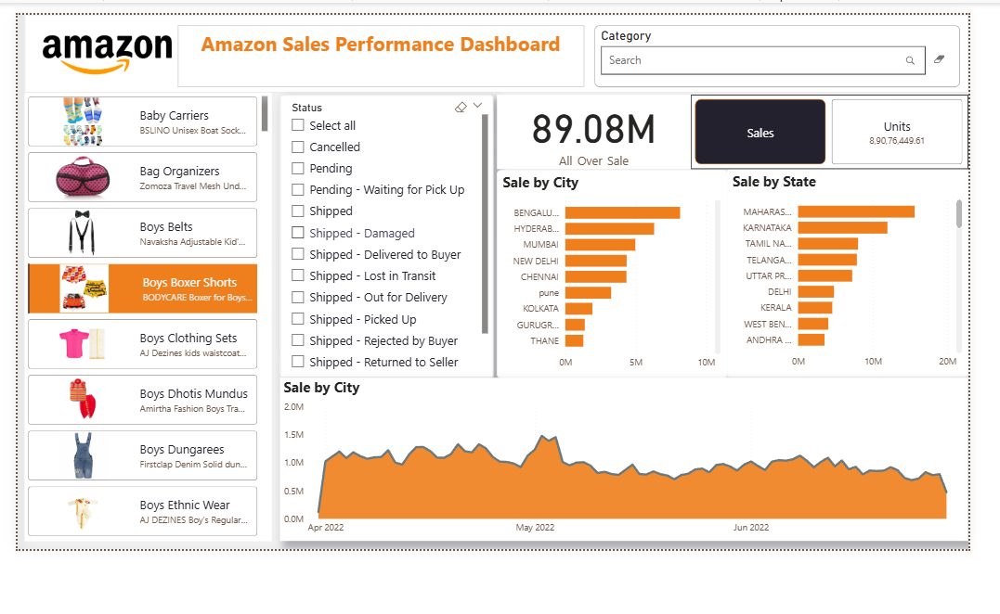

📦 Amazon Sales Dashboard: My Data Analysis Journey 🎉

📌 Overview

This repository contains my Amazon Sales Dashboard, an end-to-end Power BI data analysis project built using realistic e-commerce sales data.

The dashboard provides insights into:

Best-selling products

High-performing cities & states

Sales trends over time

Order status (Shipped, Returned, Cancelled)

Revenue & units sold

I created this dashboard to strengthen my skills in business analytics, visualization, and storytelling as a Data Analyst.

🚀 Features

✔️ KPI Cards – Total Sales, Units Sold, Orders
✔️ Top Products & Categories
✔️ Interactive Filters – City, State, Category, Order Status
✔️ Order Pipeline Visualization
✔️ Statewise & Citywise Revenue Chart
✔️ Time-Series Sales Trend
✔️ Clean business dashboard layout

🛠️ Tools & Skills Used

Power BI Desktop

Power Query

DAX (Data Analysis Expressions)

Excel

Data Cleaning & EDA

Dashboard UI/UX Principles

📂 Files Included

📊 Data Description

Columns include:

Product Category

Product Name

City

State

Sales Amount

Units Sold

Order Status (Shipped, Cancelled, Returned, Pending)

Order Date

⚙️ My Data Analysis Steps
1️⃣ Data Collection & Understanding

Collected realistic sales data

Identified business KPIs

2️⃣ Data Cleaning (Power Query)

Removed null values & duplicates

Fixed inconsistent categories & location names

Standardized formats (dates, text, numbers)

3️⃣ Exploratory Data Analysis

Category-level breakdown

City & state performance

Order status distribution

Product revenue patterns

4️⃣ Dashboard Development in Power BI

Built KPIs

Added dynamic filters

Designed charts:

Bar, Column, Line

Donut for order pipeline

Category performance

Created an interactive user-friendly layout

5️⃣ Insight Extraction

Converted visual patterns into actionable business insights.

🖼️ Dashboard Preview

🔑 Key Insights

Maharashtra and Karnataka generate the highest sales revenue.

Bengaluru is the top-performing city.

Boys’ Boxer Shorts and Baby Carriers are repeat bestsellers.

Sales show mid-quarter peaks, often during promotional periods.

A majority of orders are Shipped, showing strong fulfillment performance.

Some categories have high units but low revenue, indicating pricing gaps.

🎯 What I Learned

Cleaning & transforming real-world data

Designing a professional business dashboard

Extracting insights for decision-making

Communicating analytics clearly

Thinking like a data consultant

👩‍💻 About Me

I'm Seema Kumari, an aspiring Data Analyst passionate about transforming raw data into meaningful business insights. I’m building projects in Excel, SQL, Power BI, and Python to grow my skills.

📧 Email: kriseema87@gmail.com

🔗 LinkedIn: https://www.linkedin.com/in/seema-kumari-375763308/

💻 GitHub: https://github.com/Seema1200

✨ Thank you for viewing this project! Feel free to ⭐ star the repository.
